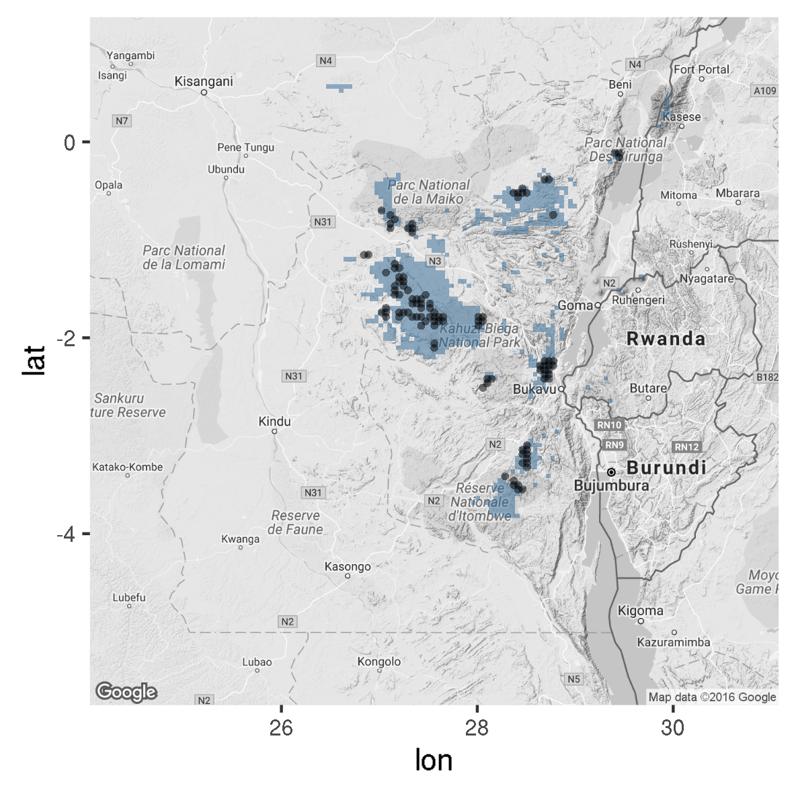

```{r load_results}
load("results/gorillas.rda")
```

#### Ghislain Vieilledent, Andrew J. Plumptre, Rob Critchlow, Stuart Nixon, Deo Kujirakwinja1, Elizabeth A. Williamson, Radar Nishuli, Andrew Kirkby and Jefferson S. Hall

## Densities from e-rates by site

```{r denserate,results="asis"}
kable(erate.dens.df[-c(4,5)],digits=c(0,0,0,2,3,3,3),longtable=TRUE)
```

## Weighted mean gorilla density (ind.km-2)

```{r dens,results="asis"}
kable(as.data.frame(dens.ci),digits=3)
```

## Species distribution area (km2)

```{r sda,results="asis"}
kable(SDA.df)
```



## Population estimates

```{r pop,results="asis"}
kable(pop.df,digits=0)
```

## Population decline in %

Accounting for 16902 gorillas in 1994 [@Hall1998a].

```{r decrease,results="asis"}
kable(decrease.df*100,digits=0)
```

## References